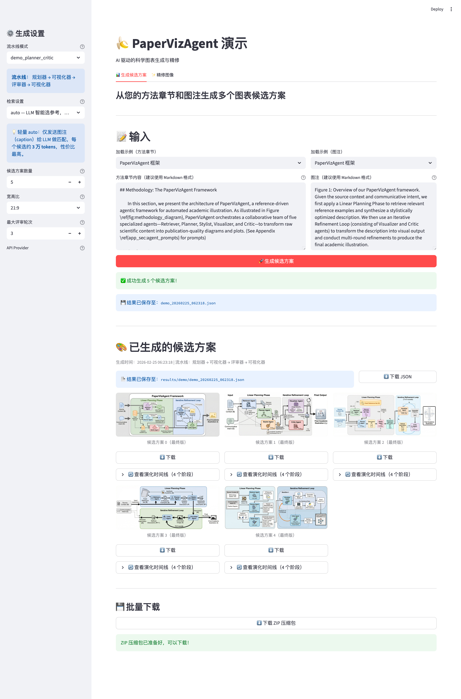
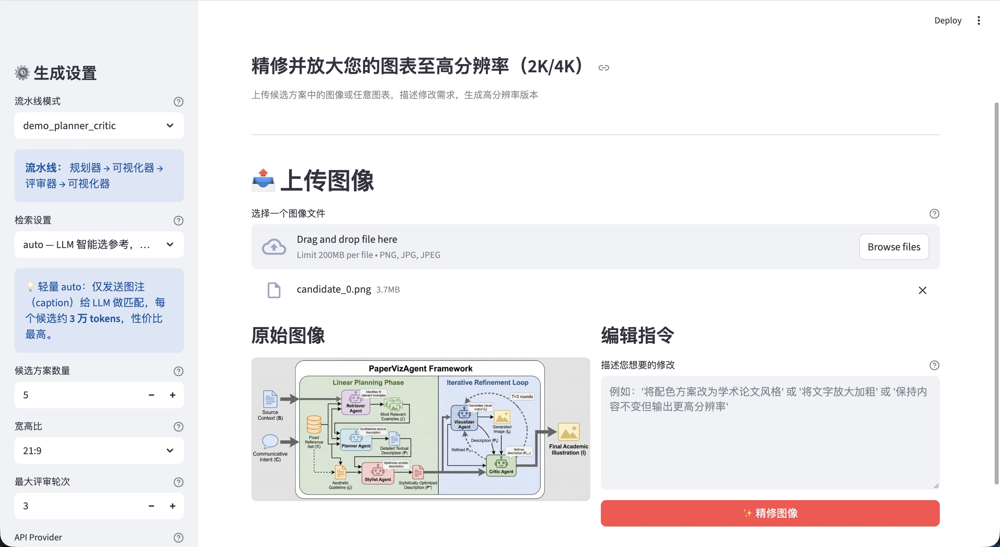
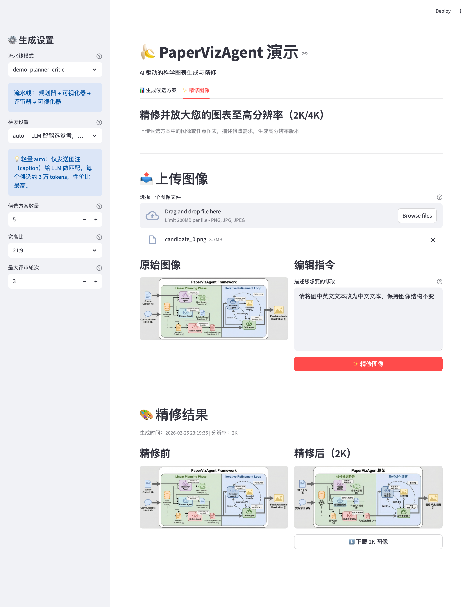

# PaperBanana-CN 学术配图助手 🍌

AI 驱动的学术论文配图生成工具 — 粘贴论文方法章节，自动生成高质量学术配图。

基于开源项目 [PaperBanana](https://github.com/dwzhu-pku/PaperBanana)（[论文](https://huggingface.co/papers/2601.23265)）改造，全中文界面，国内可直接使用。


---

## 功能介绍

### 📊 生成候选配图

粘贴论文的**方法章节**和**图注**，自动生成多个候选配图供你挑选。


背后是 5 个 AI Agent 协作的流水线：

```
检索器 → 规划器 → 风格化器 → 可视化器 → 评审器
  │         │          │           │          │
从参考库  将文字转为  优化学术    生成图像   审查图像
找类似图  图表描述    美学风格              提出改进
```

评审器和可视化器会自动迭代 3 轮，逐步优化图表质量。

- 支持并行生成 1-20 个候选方案
- 支持 21:9 / 16:9 / 3:2 等宽高比
- 每个候选可查看演化时间线（每个阶段的中间结果）
- 单张下载 / ZIP 批量下载 / JSON 完整结果导出



### ✨ 图片精修

上传已生成的配图或任意图片，描述修改需求，生成 2K/4K 高分辨率版本。



- 支持 image-to-image 编辑（基于原图修改）
- 支持纯文字描述重新生成
- 支持放大到 2K / 4K 分辨率



### 💰 智能检索，省 96% API 费用

原版 PaperBanana 的参考图检索会把 200 篇论文**全文**塞进 prompt，单次消耗 **~80 万 tokens**。我们优化为默认仅发送图注，降至 **~3 万 tokens**，效果基本不变。

| 检索模式 | Token 消耗/候选 | 说明 |
|---------|:-----------:|------|
| `auto` | ~3 万 | LLM 智能匹配参考图，仅发送图注 **（推荐）** |
| `auto-full` | ~80 万 | 发送完整论文文本，高精度但费用高 |
| `random` | 0 | 随机选 10 个参考，不调 API |
| `none` | 0 | 不使用参考图 |

> 默认配置（5 候选 + `auto`）比原版省 **96%** 检索费用，界面上每种模式都有费用提示，不会踩坑。

### 🔧 多 API 支持

内置两种 API 提供商，开箱即用：

| 模式 | 说明 | 网络要求 |
|------|------|---------|
| **Evolink**（默认） | 国内 API 代理，直连可用 | 无需翻墙 |
| **Google Gemini** | Google 官方 API | 需要科学上网 |

在界面侧边栏一键切换，模型名称自动更新。

> **说明**：本工具与 Evolink 无任何商业关联，仅作为内置的国内可用 API 方案提供。项目采用 Provider 抽象架构（见 `providers/` 目录），你可以自行集成任何兼容 OpenAI 接口的 API 服务商（如智谱 AI、通义千问、硅基流动、火山引擎等），只需参照 `providers/base.py` 的接口实现一个新的 Provider 即可。

---

## 快速开始

### 第一步：获取 API Key

**推荐 Evolink（国内直连）**：前往 https://evolink.ai/dashboard/keys 注册获取

也可以用 Google Gemini：前往 https://aistudio.google.com/apikey 获取（需翻墙）

### 第二步：启动程序

**macOS 用户**：双击 `mac-start.command`

**Windows 用户**：双击 `win-start.bat`

首次启动会自动完成以下操作（约 2-3 分钟）：
1. 检测或自动安装 Python（>= 3.10）
2. 创建虚拟环境
3. 安装所有依赖
4. 启动程序并自动打开浏览器

之后每次启动只需几秒。

### 第三步：使用

1. 在左侧边栏选择 API 提供商，填入 API Key
2. 切换到「生成候选方案」标签页
3. 粘贴论文方法章节内容 + 图注
4. 点击「生成候选方案」，等待几分钟
5. 从生成的多个候选图中挑选满意的下载

---

## 侧边栏设置说明

| 设置项 | 说明 |
|--------|------|
| API Provider | Evolink（国内直连）或 Gemini（需翻墙） |
| API Key | 对应提供商的密钥 |
| 文本模型 | 用于规划/评审的模型（默认 gemini-2.5-flash） |
| 图像模型 | 用于生成图片的模型（默认 nano-banana-2-lite） |
| 流水线模式 | `demo_planner_critic`（快速）或 `demo_full`（含风格化，更美观） |
| 检索设置 | auto / auto-full / random / none，详见上方 [检索费用对比](#-智能检索省-96-api-费用) |
| 候选方案数量 | 1-20，建议 3-5 个 |
| 宽高比 | 21:9 / 16:9 / 3:2 |
| 最大评审轮次 | 1-5，默认 3 轮 |

---

## 手动安装（可选）

如果一键脚本有问题，可以手动安装：

```bash
# 1. 确保已安装 Python 3.10+
python3 --version

# 2. 创建虚拟环境
python3 -m venv .venv
source .venv/bin/activate   # macOS/Linux
# .venv\Scripts\activate    # Windows

# 3. 安装依赖
pip install -r requirements.txt

# 4. 启动
streamlit run demo.py --server.port 8501
```

浏览器打开 http://localhost:8501 即可使用。

---

## 常见问题

**Q: 启动时报错找不到 Python？**
A: 一键脚本会自动下载便携版 Python，请确保网络通畅。也可以手动安装 Python 3.10+ 后重试。

**Q: Evolink 和 Gemini 有什么区别？**
A: 功能完全一样。Evolink 是国内代理，不需要翻墙；Gemini 是 Google 官方接口，需要科学上网。

**Q: 生成一次大概花多少钱？**
A: 取决于候选数量和检索模式。默认配置（5 候选 + `auto` 检索）约消耗 15 万文本 tokens + 5 次图像生成。比原版省 96% 检索费用。具体价格请查看 API 服务商的定价页面。

**Q: 生成需要多久？**
A: 5 个候选方案通常需要 10-15 分钟。单个候选约 2-3 分钟。

**Q: 可以不用参考数据集吗？**
A: 可以。将检索设置改为 `none` 即可，此时不需要 `data/` 目录中的数据集。

**Q: 如何停止程序？**
A: macOS 在终端按 `Ctrl+C`；Windows 关闭命令行窗口即可。

**Q: 如何集成其他 API 服务商？**
A: 参照 `providers/base.py` 定义的接口，实现 `generate_text()` 和 `generate_image()` 两个方法即可。可以参考 `providers/evolink.py` 的实现。

---

## 致谢

本项目基于 [PaperBanana](https://github.com/dwzhu-pku/PaperBanana) 开源项目改造。原始论文：

```
Zhu, Dawei, et al. "PaperBanana: Automating Academic Illustration for AI Scientists."
arXiv preprint arXiv:2601.23265 (2026).
```

许可证：Apache-2.0
